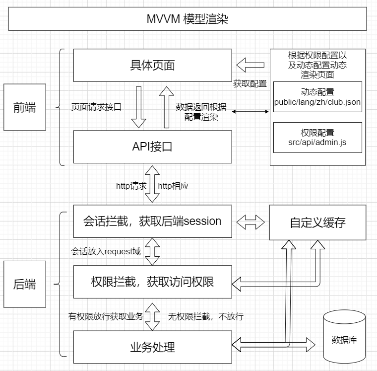

## 1.运行说明

* 1.修改配置文件config/application.yml
* 2.双击 statup.bat 或者 statup-show.bat 运行后端
* 3.浏览器打开连接 http://localhost:38080/club/static/index.html
* 4.双击 shutdown.bat 关闭后端

## 2.目录结构

> code 源码
>> club/club-auth 会话 权限拦截
>>
>> club/club-base 基础包
>>
>> club/club-core 业务逻辑
>>
>> club/club-framework 框架的基本配置
>>
>> club/club-front 前端文件
>>> public 前端静态文件
>>>> lang/zh/club.json (非常重要)前端结构配置,所有的前端配置都必须和它结合起来渲染页面 里面的**中文** 、**icon图标**可修改(不能改变其结构)
>>> 
>>> src 前端代码
>>>> api 全局api接口定义和权限定义存放地
>>>> 
>>>> components 全局组件存放地
>>>> 
>>>> dialog 对话框
>>>> 
>>>> font 字体
>>>> 
>>>> layout 面板页面相关
>>>> 
>>>> page 具体页面相关
>
> config 配置文件
>
> static 打包后的前端文件 能直接访问到的通用访问路径http://localhost:38080/club/static/********

## 3.后端

### 环境
* maven 3+
* jdk8+

### 运行、打包及部署 (jar 包方式)
* 运行 code\club\club-boot\src\main\java\com\club\boot\Application.java
* 打包 mvn clean install
* 部署 将code\club\club-boot\club.jar放到 某文件夹并将 前端dist内的所有文件和code\club\club-boot\club.json放入该文件夹中的static 最后执行命令：java -jar club.jar

* 部署后的文件夹结构
> 某文件夹
>> club.jar
>>
>> static
>>> club.json
>>>
>>> 前端打包后文件夹dist内所有文件
>>

## 4.前端

### 环境
* node
* yarn
### 运行及打包（命令）
* 安装依赖 yarn
* 运行 yarn dev
* 打包 yarn build  （打包目录dist）

## 5.架构（MVVM模型）
